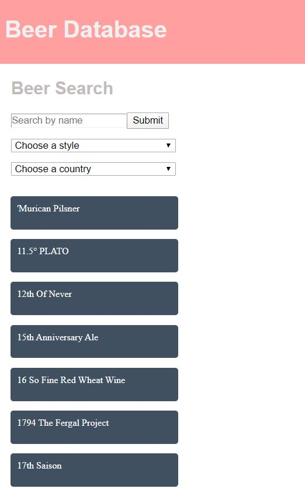

# Beer Database - beer search app
> This beer database makes use of the breweryDB api to search beers by name, and filter by type and country. 

## Table of contents
* [General info](#general-info)
* [Screenshots](#screenshots)
* [Technologies](#technologies)
* [Setup](#setup)
* [Code explanation](#code-explanation)
* [Features](#features)
* [Status](#status)
* [Resources](#resources)
* [Contact](#contact)

## General info
For this project I wanted to focus on using Angular and Typescript as my core frontend technologies. Before this project I had never worked with either, having only been taught ReactJS at the bootcamp I attended. I also decided to create a NodeJS server using the ExpressJS framework to handle my breweryDB endpoint requests, since breweryDB does not support CORS. I feel that caching would really improve some aspects of this project, however learning a third new skill was a bit much for me. 

## Screenshots

## Technologies
* Angular version: 9.1.1
* TypeScript version: 3.8.3
* rxjs version: 6.5.5
* NodeJS version: 12.16.2
* ExpressJS version: 4.16.4

## Setup
Clone this repo to your desktop then run `npm install` in both api, and client folders to install all depndencies.

Port for `beer-assessment-client` is localhost:4200.
Port for `beer-assessment-api` is localhost:4000.

## Code explanation
During this project I was particularly challenged by determining efficient methods of calling the api's endpoints. Particularly when filtering beers by country, as there is no direct relationship between a beer and a country. To solve this I decided to first get the `location.country.countryIsoCode`, `location.country.name`, and the `location.breweryId` with this url, `https://sandbox-api.brewerydb.com/v2/locations/?key=${apiKey}`. With this information I then mapped the breweryIds for each country. 

When the user selects a country the request for this url, `https://sandbox-api.brewerydb.com/v2/brewery/${breweryId}/beers/?key=${apiKey}` executes, and finds the beers for each breweryId associated with the selected country and returns them. I decided to go this route, instead of querying the `https://sandbox-api.brewerydb.com/v2/beers/?key=${apiKey}&withBreweries=y`endpoint to find the breweryId associated with each beer to minimize the number of requests to the api.

In an effort to keep api calls down I paginated the beers filtered by country request. To do this I made the `router.get` in `beers.js` async to accomodate the await needed for the calls to the `https://sandbox-api.brewerydb.com/v2/brewery/${breweryId}/beers/?key=${apiKey}` endpoint. I did this to load an array of 50 beers initially, then when the user clicks the next page it will make another call to the api to get an array with 50 beers in addition to the first 50. Then I use the `.splice` method to remove the first 50 * #ofpreviouspages. Therefore, subsequent page's load time becomes longer and longer. 

I decided to include pagination as, if you only query  `https://sandbox-api.brewerydb.com/v2/beers/?key=${apiKey}` then you only get back the first page of beers, so included in my first request for the beers list I include `p=1` at the end of the above url. 

For the styles I used the `/styles` endpoint to get all style.Ids and style.names. After the user has selected a style, I then use the `/beers` endpoint with the styleId query parameter. 

## Features
List of features ready and TODOs for future development
* Search Beers includes all pages from breweryDB
* Filter all beers by style
* Filter all beers by country

To-do list:
* Improve the way in which I load the country information for beers
* Implement caching

## Status
Project is: _in progress_

## Resources
Angular Heroes Tutorial

## Contact
Created by Hannah Hawes